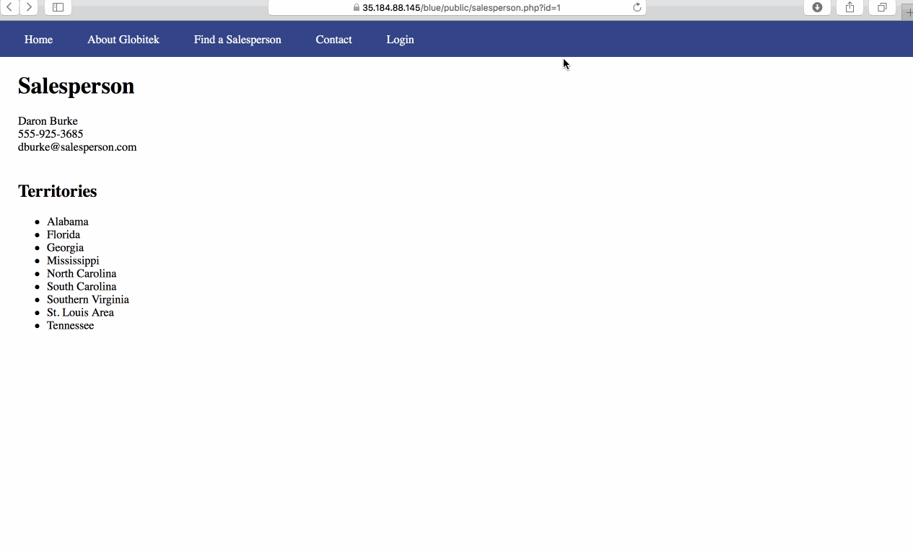

# codepathWeek8
This weeks objective was to identify vunerabilities in three different versions of the Globitek website: Blue, Green, and Red.

## Blue
Vunerability #1: SQL Injection

On the salesperson information page with the format id=?? in the url. If you just add a ' the website gives you a database query failed error therefor there is an SQL injection vunerability if you know what you are doing.

Vunerability #2:

## Green
Vunerability #1: User Enurmation

When using a username and password that doesnt exist. The site states "Log in was unsuccessful." When you use a username that does exist with a random password, it shows a bold "Log in was unsuccessful.".

Vunerability #2: Cross-Site Scripting

## Red
Vunerability #1: Insecure Direct Object Reference

The salesperson database can be accessed past what it shows on the page with the id tag. The page ends with the id tag 9 while if you change the ID tag to ten it still works.

Vunerability #2: 
